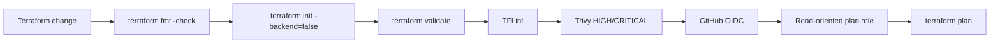
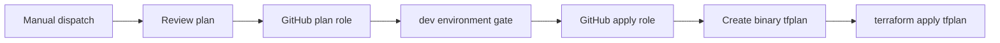

# Scalable AWS Web Application with Terraform

[](https://github.com/flaviomurata/aws-scalable-web-app/actions/workflows/terraform-ci.yml)
[](https://github.com/flaviomurata/aws-scalable-web-app/actions/workflows/security.yml)
[](https://developer.hashicorp.com/terraform)
[](https://aws.amazon.com/)
[](LICENSE)

A production-inspired AWS infrastructure project that rebuilds an AWS Academy capstone project as modular Terraform, then adds CI/CD, workload identity federation, observability, automated scaling, remote state, and DevSecOps controls.

The project is intentionally designed as a **portfolio-grade reference architecture**: it demonstrates not only how to provision AWS resources, but also how to operate Terraform safely through automated checks, constrained IAM roles, documented security decisions, and repeatable teardown.

> [!IMPORTANT]
> **Deployment status:** the demonstration AWS environment has been intentionally torn down to avoid ongoing cloud costs. The Terraform, bootstrap, CI/CD, security, and observability implementations remain in this repository and are reproducible in another AWS account. Authenticated `plan` and deployment jobs require the bootstrap layer to be recreated and the repository variables to point to the new account.

## Table of contents

- [Architecture](#architecture)
- [What this project demonstrates](#what-this-project-demonstrates)
- [Design decisions](#design-decisions)
- [Repository structure](#repository-structure)
- [Infrastructure modules](#infrastructure-modules)
- [CI/CD](#cicd)
- [Security](#security)
- [Observability](#observability)
- [Auto Scaling](#auto-scaling)
- [Remote state and bootstrap](#remote-state-and-bootstrap)
- [Getting started](#getting-started)
- [Deployment workflow](#deployment-workflow)
- [Validation](#validation)
- [Outputs](#outputs)
- [Cost considerations](#cost-considerations)
- [Teardown](#teardown)
- [Known trade-offs and production improvements](#known-trade-offs-and-production-improvements)
- [Project background](#project-background)
- [License](#license)

## Architecture


### Request and dependency flow

1. Users reach the application through the internet-facing **Application Load Balancer**.
2. The ALB forwards requests only to application instances in **private subnets**.
3. EC2 instances run in an **Auto Scaling Group** distributed across both Availability Zones.
4. The application reads database connection data from **AWS Secrets Manager** through an instance IAM role.
5. The application reaches **RDS MySQL** over port `3306`; the database security group only accepts traffic from the application security group.
6. Private instances use **NAT Gateways** for required outbound bootstrap and package traffic without accepting inbound internet connections.
7. **CloudWatch** monitors application and database health, while **SNS** provides alarm delivery.
8. **GitHub Actions** authenticates to AWS through OIDC instead of storing long-lived AWS access keys.

## What this project demonstrates

| Area | Implementation |
| --- | --- |
| Infrastructure as Code | Terraform root module plus capability-oriented child modules |
| Networking | Custom VPC, two AZs, public/private subnet separation, IGW, per-AZ NAT Gateways |
| Compute | EC2 Launch Template and Auto Scaling Group in private subnets |
| Traffic management | Internet-facing Application Load Balancer and target group health checks |
| Database | Private Amazon RDS for MySQL with a dedicated security group |
| Secrets | Randomly generated database credentials stored in AWS Secrets Manager |
| Scaling | Target-tracking EC2 Auto Scaling based on average CPU utilization |
| State management | Versioned, encrypted S3 remote state with native S3 state locking |
| CI | Terraform formatting, validation, TFLint, Trivy, and authenticated plans |
| CD | Manually triggered Terraform deployment workflow with a protected `dev` environment |
| AWS authentication | GitHub Actions OIDC with separate plan and apply roles |
| Observability | CloudWatch alarms, CloudWatch dashboard, and SNS alert topic |
| DevSecOps | Trivy IaC scanning, Gitleaks secret scanning, SHA-pinned Actions, Dependabot |
| Local quality gates | Pre-commit/`prek`, formatting, validation, linting, security, typo checks |

## Design decisions

### Public ingress, private compute

The ALB is the only application component designed to receive public traffic. Application EC2 instances have no public IP dependency and are placed in private subnets. The database is also private and is reachable only from the application security group.

```text
Internet -> public ALB -> private application instances -> private RDS
```

### Two Availability Zones for the application tier

The VPC provides two public and two private subnets across separate Availability Zones. The ALB spans the public subnets and the Auto Scaling Group places application instances across the private subnets.

The development RDS instance is deliberately **Single-AZ**, so the application tier is resilient to an instance/AZ failure but the database tier is not fully highly available. Multi-AZ RDS is listed as a production improvement rather than being hidden behind a "highly available" claim.

### One NAT Gateway per public subnet

Each private subnet routes outbound internet traffic through a NAT Gateway in its corresponding Availability Zone. This avoids introducing a single NAT Gateway as a cross-AZ dependency for the application tier, at the cost of higher hourly infrastructure spend.

### Security groups model application relationships

Security-group rules express service-to-service relationships rather than broadly opening internal tiers. Examples include:

- internet -> ALB on the application listener port;
- ALB security group -> application security group;
- application security group -> database security group on MySQL `3306`;
- application egress -> required HTTP/HTTPS destinations through NAT.

### Target tracking owns scaling behavior

EC2 Auto Scaling uses target tracking with average ASG CPU utilization. Terraform therefore does not create manual CPU scale-out/scale-in alarms that would duplicate the controller's responsibility. Operational CloudWatch alarms focus on health and capacity instead.

### Workload identity instead of stored AWS keys

GitHub Actions uses `AssumeRoleWithWebIdentity` against the GitHub OIDC provider. There are no static AWS access keys required by the workflows.

Two roles intentionally separate responsibilities:

- **plan role** — read-oriented access to infrastructure and Terraform state, without permission to write the actual state object;
- **apply role** — infrastructure mutation permissions, state write access, and a trust policy scoped to the protected `dev` GitHub Environment.

### Security findings are reviewed, not blindly suppressed

Trivy blocks unreviewed `HIGH` and `CRITICAL` Terraform misconfigurations. Findings that represent real defects are fixed; intentional development trade-offs are suppressed narrowly beside the relevant Terraform resource and documented in code.

Examples of accepted development trade-offs include the public ALB, HTTP-only demo listener, required bootstrap egress, SSE-S3 instead of a customer-managed state KMS key, and an unencrypted development SNS topic.

## Repository structure

```text
.
├── .github/
│   ├── dependabot.yml
│   └── workflows/
│       ├── security.yml
│       ├── terraform-ci.yml
│       └── terraform-deploy.yml
├── bootstrap/
├── docs/
│   └── lab-walkthrough.md
├── envs/
│   └── dev/
│       ├── backend.hcl
│       └── terraform.tfvars
├── modules/
│   ├── application/
│   ├── database/
│   ├── networking/
│   └── observability/
├── .pre-commit-config.yaml
├── .terraform.lock.hcl
├── .tflint.hcl
├── locals.tf
├── main.tf
├── outputs.tf
├── providers.tf
├── variables.tf
└── versions.tf
```

The layout follows the principle that the root module should compose higher-level capabilities while individual modules own related AWS resources.

## Infrastructure modules

### `networking`

Creates the network foundation used by every other module:

- VPC;
- two Availability Zones;
- two public subnets;
- two private subnets;
- Internet Gateway;
- public and private route tables;
- one Elastic IP and NAT Gateway per public subnet.

Public subnets do **not** automatically assign public IP addresses to arbitrary EC2 instances. Their "public" behavior comes from routing to the Internet Gateway.

### `database`

Owns the persistence and database-secret boundary:

- RDS subnet group spanning the private subnets;
- RDS MySQL instance;
- database security group;
- generated database password;
- Secrets Manager secret containing the application database connection data.

The application receives the secret ARN/name as module outputs instead of embedding credentials in Terraform consumers or application source.

### `application`

Owns the web/application tier:

- ALB security group;
- application security group;
- Application Load Balancer;
- target group and listener;
- EC2 IAM role and instance profile;
- Launch Template;
- Auto Scaling Group;
- target-tracking Auto Scaling policy;
- application bootstrap via `user_data`.

The bootstrap process installs the dependencies required by the original AWS Academy Node.js application, retrieves the database secret at runtime, initializes the schema, and starts the application as a `systemd` service.

### `observability`

Creates operational visibility around the deployed workload:

- SNS alert topic and publish policy;
- ALB unhealthy-target alarm;
- target HTTP 5xx alarm;
- ASG in-service capacity alarm;
- RDS high-CPU alarm;
- RDS low-free-storage alarm;
- CloudWatch operational dashboard.

## CI/CD

The repository separates static validation, authenticated planning, and deployment.

### Terraform CI

`.github/workflows/terraform-ci.yml` runs static checks for Terraform changes and performs an authenticated plan on `main` when the AWS bootstrap layer exists.



The static job only needs `contents: read`. The plan job adds `id-token: write` specifically because OIDC token issuance is required there.

### Terraform deployment

`.github/workflows/terraform-deploy.yml` is intentionally manual (`workflow_dispatch`). It follows a plan-then-apply structure:



The apply job creates a binary Terraform plan and applies that exact plan rather than running an unconstrained `terraform apply` against a potentially changed configuration.

### Security workflow

`.github/workflows/security.yml` runs Gitleaks independently of Terraform file filters so secrets can be detected in any committed file type, not only `.tf` or `.hcl` files.

The workflow checks out full Git history (`fetch-depth: 0`) and runs under `contents: read` permissions.

### Supply-chain hardening

Third-party GitHub Actions are referenced by immutable full-length commit SHAs, with human-readable version comments beside them. Dependabot is configured for the `github-actions` ecosystem to open update pull requests while preserving immutable pinning.

## Security

Security controls are applied at multiple layers rather than relying on a single scanner.

### AWS and network controls

- application instances run in private subnets;
- RDS is private;
- tier-to-tier access is expressed through security-group references;
- database credentials are generated and stored in Secrets Manager;
- EC2 uses an IAM role to read the application secret;
- public subnet auto-public-IP assignment is disabled;
- the ALB drops invalid HTTP header fields;
- the Terraform state bucket blocks public access;
- the Terraform state bucket denies non-TLS S3 transport;
- Terraform state is encrypted at rest with SSE-S3;
- state bucket versioning is enabled.

### CI identity controls

- GitHub Actions authenticates with OIDC;
- no repository AWS access-key secret is required;
- plan and apply roles have different permissions;
- the plan role can read the state object but cannot write it;
- both roles receive only temporary STS credentials;
- the apply role trust relationship is scoped to the `dev` GitHub Environment.

### Automated security checks

| Layer | Tool | Purpose |
| --- | --- | --- |
| Local commit | Gitleaks | Detect likely hardcoded credentials before commit |
| Local commit | Trivy | Block HIGH/CRITICAL Terraform misconfigurations |
| Local commit | TFLint | Catch Terraform/AWS lint issues |
| CI | Gitleaks | Scan repository history for secrets |
| CI | Trivy | Enforce IaC security policy |
| Dependency hygiene | SHA pinning | Prevent mutable Action tags from silently changing workflow code |
| Dependency updates | Dependabot | Propose controlled GitHub Action upgrades |

### Intentional security exceptions

| Decision | Rationale | Production direction |
| --- | --- | --- |
| Internet-facing ALB | The application is intentionally public | Retain public ALB, add WAF/rate controls if required |
| HTTP listener | Demo used the AWS-generated ALB hostname | Add Route 53/custom DNS, ACM certificate, HTTPS listener, HTTP -> HTTPS redirect |
| Broad HTTP/HTTPS egress from app SG | User data needs OS/package/application downloads and AWS API access | Pre-bake an AMI/container, use VPC endpoints and/or controlled egress |
| SSE-S3 for Terraform state | Adequate encrypted-at-rest baseline for a single-account development project | Use customer-managed KMS key and explicit key policy where required |
| SNS without KMS CMK | Alerts contain operational metadata and CMK service integration adds policy complexity | Encrypt with a customer-managed KMS key and CloudWatch/SNS KMS permissions |

These are treated as **documented accepted risks**, not as false claims that the controls do not matter.

## Observability

The observability layer focuses on conditions that would matter to an operator rather than simply collecting every available metric.

| Signal | Alarm intent |
| --- | --- |
| ALB unhealthy targets | Detect application instances failing target health checks |
| Target HTTP 5xx | Detect server-side failures returned by the application tier |
| ASG in-service capacity | Detect the group dropping below its configured minimum healthy capacity |
| RDS CPU | Detect sustained database compute pressure |
| RDS free storage | Detect low remaining database storage |

The CloudWatch dashboard combines alarm state, ALB health and errors, ASG desired vs. in-service capacity, and RDS CPU/free-storage metrics.

Alarm transitions publish to a dedicated SNS topic. Email subscriptions are intentionally operational/manual because email confirmation cannot be completed purely through Terraform.

## Auto Scaling

The application Auto Scaling Group defaults to:

| Setting | Value |
| --- | ---: |
| Minimum capacity | `2` |
| Maximum capacity | `4` |
| Target average CPU | `50%` |
| Instance type | `t3.micro` |

Detailed EC2 monitoring and one-minute ASG group metrics support operational visibility. Target tracking controls desired capacity; Terraform does not continuously fight that runtime-owned value.

The original deployment was validated by generating load until the group scaled above its minimum capacity and then observing it return to the baseline after load subsided.

## Remote state and bootstrap

The repository uses a separate `bootstrap/` Terraform root because the backend cannot depend on infrastructure from the same state it is meant to store.

The bootstrap layer creates:

- S3 remote-state bucket;
- S3 versioning;
- SSE-S3 encryption;
- public-access block;
- TLS-only bucket policy;
- GitHub OIDC provider;
- GitHub Terraform plan role;
- GitHub Terraform apply role.

The main root declares a partial S3 backend:

```hcl
terraform {
  backend "s3" {}
}
```

Environment-specific backend values live in `envs/dev/backend.hcl`.

State locking uses S3's native lock file support (`use_lockfile = true`), so this project does not require a DynamoDB locking table.

> [!NOTE]
> The checked-in `envs/dev/backend.hcl` records the original demonstration backend name. When reproducing the project in another AWS account, update its bucket value to the bucket created by your new bootstrap deployment before initializing the root module.

## Getting started

### Prerequisites

You need:

- an AWS account with permissions to create the resources represented by this project;
- AWS CLI configured with an authenticated human identity;
- Terraform `>= 1.11.0`;
- Git;
- `prek` or `pre-commit` for the local quality-gate workflow;
- TFLint and Trivy available when running the corresponding local hooks.

The repository currently constrains the AWS provider to `~> 6.0` and the Random provider to `~> 3.9`.

### 1. Clone

```bash
git clone https://github.com/flaviomurata/aws-scalable-web-app.git
cd aws-scalable-web-app
```

### 2. Authenticate to AWS

For example, with IAM Identity Center / AWS SSO:

```bash
aws sso login
aws sts get-caller-identity
```

Always verify the returned account before provisioning infrastructure.

### 3. Configure the development environment

`envs/dev/terraform.tfvars` contains the development defaults:

```hcl
aws_region   = "sa-east-1"
project_name = "student-records"
environment  = "dev"

vpc_cidr = "10.0.0.0/16"

public_subnet_cidrs = [
  "10.0.1.0/24",
  "10.0.2.0/24",
]

private_subnet_cidrs = [
  "10.0.10.0/24",
  "10.0.20.0/24",
]

db_instance_class = "db.t4g.micro"
app_instance_type = "t3.micro"
```

Review these values before deploying. In particular, verify the AWS Region and whether the selected instance classes are available and appropriate for the target account.

## Deployment workflow

### 1. Bootstrap the backend and GitHub AWS identities

```bash
terraform -chdir=bootstrap init

terraform -chdir=bootstrap plan \
  -var='aws_region=sa-east-1' \
  -var='project_name=student-records'

terraform -chdir=bootstrap apply \
  -var='aws_region=sa-east-1' \
  -var='project_name=student-records'
```

Inspect the outputs:

```bash
terraform -chdir=bootstrap output
```

The useful bootstrap outputs are:

- `state_bucket_name`;
- `github_plan_role_arn`;
- `github_apply_role_arn`.

### 2. Configure the main backend

Set the bucket in `envs/dev/backend.hcl` to the `state_bucket_name` created in the current AWS account. Keep the state key and Region consistent with the environment you intend to deploy.

Then initialize:

```bash
terraform init \
  -backend-config=envs/dev/backend.hcl
```

### 3. Review locally

```bash
terraform plan \
  -var-file=envs/dev/terraform.tfvars
```

### 4. Configure GitHub repository variables

The authenticated workflows expect repository/environment configuration equivalent to:

| Variable | Purpose |
| --- | --- |
| `AWS_ACCOUNT_ID` | Guard against assuming a role in the wrong AWS account |
| `AWS_REGION` | Region used by GitHub Actions |
| `AWS_PLAN_ROLE_ARN` | OIDC role used by Terraform plan jobs |
| `AWS_APPLY_ROLE_ARN` | OIDC role used by the protected deployment job |

### 5. Deploy

After static CI succeeds, run the **Terraform Deploy** workflow manually from GitHub Actions. The workflow first obtains a plan identity, then uses the protected `dev` environment before the apply identity is assumed.

## Validation

### Local quality gates

Run every configured hook across the repository:

```bash
prek run --all-files
```

The configured checks include large-file detection, YAML validation, whitespace/newline normalization, typo detection, Terraform formatting and validation, TFLint, Trivy, and Gitleaks.

### Terraform checks without hooks

```bash
terraform fmt -check -recursive
terraform init -backend=false
terraform validate
tflint --recursive
trivy config --severity HIGH,CRITICAL --exit-code 1 .
```

### Runtime checks after a deployment

```bash
terraform output application_url
terraform output cloudwatch_dashboard_name
terraform output application_autoscaling_group_name
```

Then verify:

- the ALB target group reports healthy instances;
- the application responds through the ALB URL;
- the ASG has instances in both private subnets/AZs;
- the database is not publicly accessible;
- alarm resources and the CloudWatch dashboard exist;
- a controlled load test can trigger scale-out and later scale-in.

## Outputs

| Output | Description |
| --- | --- |
| `vpc_id` | Project VPC ID |
| `public_subnet_ids` | Public subnet IDs |
| `private_subnet_ids` | Private subnet IDs |
| `db_address` | RDS DNS address |
| `database_security_group_id` | RDS security group ID |
| `application_database_secret_arn` | Secret ARN consumed by the application |
| `application_url` | Public ALB application URL |
| `application_autoscaling_group_name` | Application ASG name |
| `alert_topic_arn` | SNS operational-alert topic ARN |
| `cloudwatch_dashboard_name` | CloudWatch dashboard name |

## Cost considerations

This architecture is deliberately more realistic than a single-instance lab deployment, which means it can incur meaningful hourly charges while running.

The most important cost-bearing resources are typically:

- **two NAT Gateways** plus processed data;
- **RDS** instance and storage;
- **Application Load Balancer**;
- **EC2** instances maintained by the ASG;
- public IPv4/Elastic IP-related charges where applicable;
- CloudWatch metrics/alarms beyond free allocations.

The S3 Terraform state bucket, GitHub OIDC provider, and IAM roles are comparatively lightweight, but all pricing should be checked against the target Region before deployment.

For a short-lived portfolio/demo environment, a strong operating pattern is:

```text
bootstrap once -> deploy workload -> validate/demo -> destroy workload
```

If the AWS account itself is being retired, destroy the bootstrap layer as well after the workload has been removed.

## Teardown

### Workload-only cleanup

Keep the backend/OIDC foundation but remove the cost-bearing application infrastructure:

```bash
terraform destroy \
  -var-file=envs/dev/terraform.tfvars
```

Afterward:

```bash
terraform state list
```

should return no root workload resources.

### Full project cleanup

The bootstrap S3 bucket is intentionally protected from accidental destruction in the normal project configuration. A full cleanup therefore requires an explicit, temporary lifecycle change that allows the versioned bucket to be emptied and destroyed.

A safe high-level order is:

1. destroy the main workload while the remote backend still exists;
2. verify the root state is empty;
3. explicitly allow the bootstrap state bucket to be destroyed;
4. apply that bootstrap configuration change so it is recorded in bootstrap state;
5. destroy `bootstrap/`;
6. verify the state bucket, OIDC provider, and GitHub IAM roles are gone.

Do not delete the remote-state bucket before the workload teardown has successfully completed.

## Known trade-offs and production improvements

This project intentionally stops before several controls that would be expected in a production system. They are documented here so the boundary between "implemented" and "production-ready" remains explicit.

### HTTPS and DNS

**Current design:** HTTP listener on the public ALB using the AWS-generated load-balancer hostname.

**Production direction:** own a DNS name, issue an ACM certificate, serve HTTPS on `443`, redirect HTTP `80` to HTTPS, and consider HSTS/AWS WAF based on requirements.

### Database high availability

**Current design:** Single-AZ development RDS instance.

**Production direction:** enable Multi-AZ RDS and define backup, retention, recovery, maintenance, and upgrade policies appropriate to the workload.

### Egress hardening

**Current design:** application instances use NAT-based HTTP/HTTPS internet egress because bootstrap installs OS packages, the AWS CLI, and application dependencies dynamically.

**Production direction:** create a hardened AMI or immutable application image, remove runtime dependency installation where practical, use VPC endpoints for supported AWS services, and introduce controlled egress where justified.

### Key management

**Current design:** state uses SSE-S3; the development SNS alert topic is not KMS-encrypted.

**Production direction:** customer-managed KMS keys with explicit service and workload key policies where compliance or control requirements justify the operational overhead.

### Delivery strategy

**Current design:** EC2 user data downloads and configures the original AWS Academy application during instance bootstrap.

**Production direction:** build immutable application artifacts through CI, version them, verify provenance, and deploy a known artifact rather than downloading dependencies dynamically at instance launch.

### Additional observability

Potential extensions include centralized application/system logs, ALB access logs, VPC Flow Logs, structured application metrics, CloudWatch Logs Insights queries, SLOs/error-budget alerts, and tracing where warranted.

## Project background

This repository evolved from the **AWS Academy Cloud Web Application Builder** lab. The original lab established the functional target: a student-records application that progresses from a basic deployment toward load balancing, scaling, private database access, and secret management.

This repository takes that architecture further by rebuilding it as reusable Terraform and adding engineering practices outside the original lab scope:

- modular IaC;
- remote state and locking;
- GitHub Actions CI/CD;
- OIDC-based AWS authentication;
- least-privilege-oriented plan/apply roles;
- target-tracking scaling managed as code;
- CloudWatch/SNS observability;
- Trivy IaC scanning;
- Gitleaks secret scanning;
- immutable GitHub Action references;
- Dependabot-managed Action updates;
- documented security exceptions and teardown procedures.

For the original manual lab progression, screenshots, and validation notes, see [`docs/lab-walkthrough.md`](docs/lab-walkthrough.md).

## License

This repository is licensed under the terms in [`LICENSE`](LICENSE).
